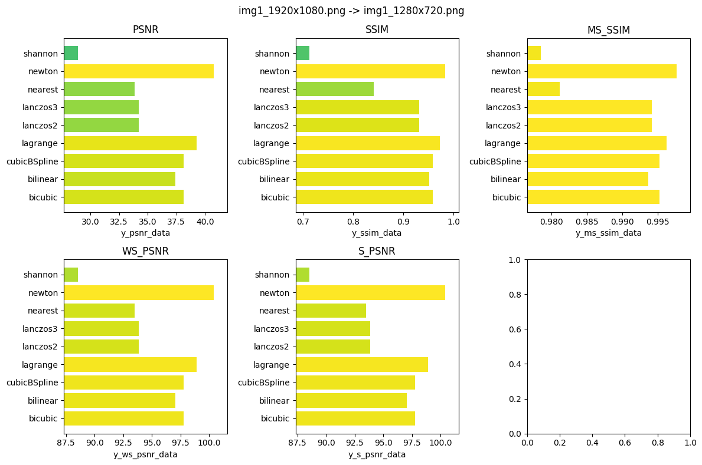

# 演示

Img | Evaluate
:-------------------------:|:-------------------------:
  |   
 |   
  |   
  |   

# 插值算法

1. 最近邻 Nearest
2. 双线性 Bilinear
3. 双立方 Bicubic
4. 三次B样条 CubicBSpline
5. 拉格朗日 Lagrange
6. 牛顿 Newton
7. 兰索斯 Lanczos2, Lanczos3
8. 香农 Shannon

# 图像评价指标

### PSNR
峰值信噪比(Peak Signal to Noise Ratio, PSNR)是一种评价图像质量的度量标准。因为PSNR值具有局限性，所以它只是衡量最大值信号和背景噪音之间的图像质量参考值。PSNR的单位为dB，其值越大，图像失真越少。一般来说，PSNR高于40dB说明图像质量几乎与原图一样好；在30-40dB之间通常表示图像质量的失真损失在可接受范围内；在20-30dB之间说明图像质量比较差；PSNR低于20dB说明图像失真严重。

### SSIM
结构相似性指数（structural similarity index，SSIM）是一种用于量化两幅图像间的结构相似性的指标。与L2损失函数不同，SSIM仿照人类的视觉系统（Human Visual System,HVS）实现了结构相似性的有关理论，对图像的局部结构变化的感知敏感。SSIM从亮度、对比度以及结构量化图像的属性，用均值估计亮度，方差估计对比度，协方差估计结构相似程度。SSIM值的范围为0至1，越大代表图像越相似。如果两张图片完全一样时，SSIM值为1。

### WS_PSNR
(Weighted Sum of PSNR，加权峰值信噪比)：WS-PSNR是PSNR的一种变种指标，在计算图像的均方误差时，引入了不同区域的权重因子。通过对权重因子进行加权求和，可以获取考虑了不同区域重要性的图像质量评估。

### MS_SSIM
(Multi-Scale Structural Similarity Index，多尺度结构相似性指数)：MS-SSIM是在SSIM的基础上进行了改进的指标。它通过将图像分解为不同的尺度空间，并对每个尺度空间进行SSIM计算，然后对各个尺度空间的SSIM值进行加权平均，得到最终的相似性评分。MS-SSIM主要用于评估对于不同尺度的结构信息的保留情况。

### S_PSNR
S-PSNR是一种基于结构信息的图像评估指标。它将图像分解为多个结构组件，并对每个结构组件的PSNR进行计算，然后对各个结构组件的PSNR值进行加权求和，得到最终的评估结果。S-PSNR主要用于考虑图像结构重要性的图像质量评估。

# 目录结构
```
├─data
│  ├─src        # [存放原图像]
│  │  ├─img1_1280x720.png
│  │  ├─img1_160x90.png
│  │  └─...
│  └─target     # [存放缩放后的图像]
│      ├─img1_1280x720      # [被缩放的图像名]
│      │  ├─bicubic             # [缩放算法]  
│      │  |  ├─img1_160x90.png      # [缩放后的图像]
│      │  |  └─...
│      │  ├─bilinear
│      │  └─...
│      ├─img1_160x90
│      │  ├─...
│      │  └─...
│      └─...
├─go
│  ├─nearest
│  └─util
├─matlab
│  ├─algorithm  # [存放缩放算法]
│  │  ├─Bicubic
│  │  ├─...
│  │  └─...
│  └─runner     # [入口]
│     ├─main_horizontal.m       # [处理宽度>高度的图像入口]
│     ├─main_vertical.m         # [处理高度>宽度的图像入口]
│     └─scaling_single_img.m    # [缩放单个图像]
└─view
    ├─utils     # [工具类]
    │  ├─chart_barh.py          # [画横向柱状图]
    │  ├─evaluate.py            # [计算图像评估指标]
    │  ├─img.py                 # [多张图拼图]
    │  └─log.py                 # [日志函数]
    ├─multi_evaluate.py     # [多图评估]
    ├─evaluate_img1.ipynb   # [评估 img1]
    ├─evaluate_img2.ipynb   # [评估 img2]
    ├─evaluate_img3.ipynb   # [评估 img3]
    ├─...
    └─...
```